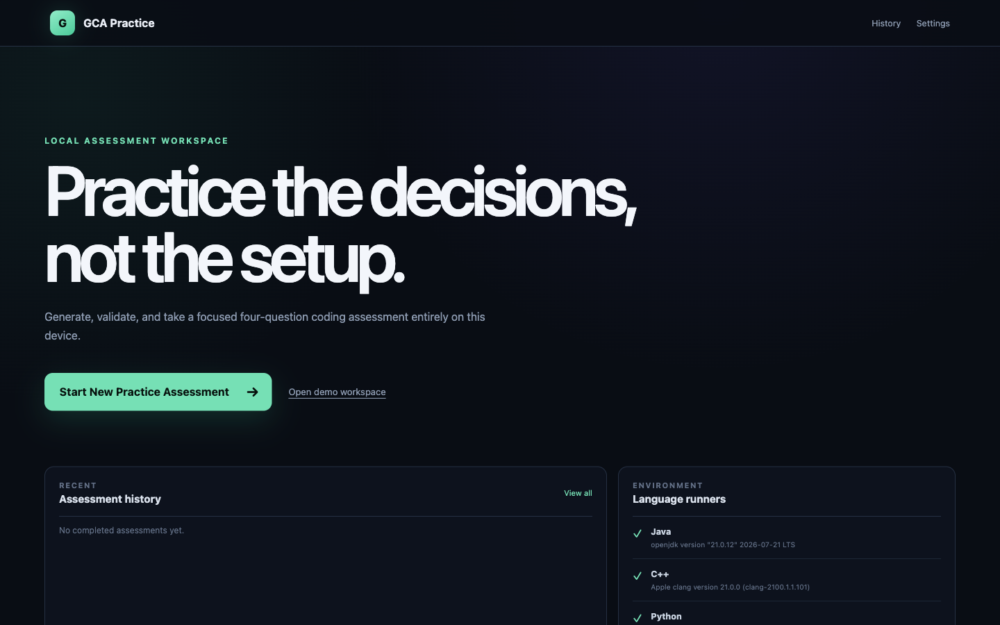
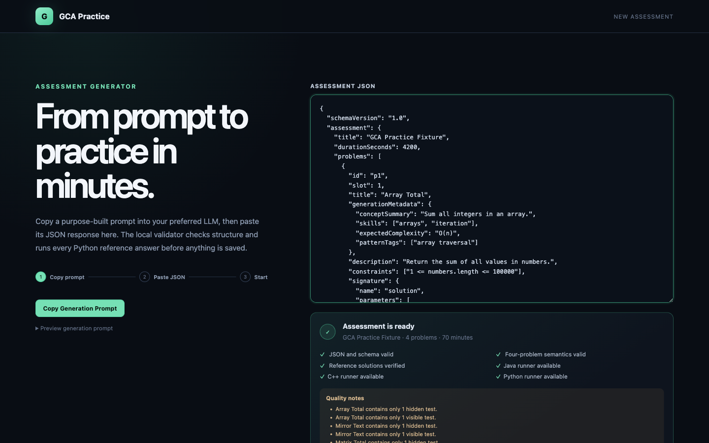
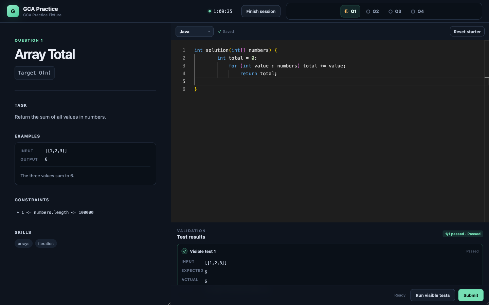
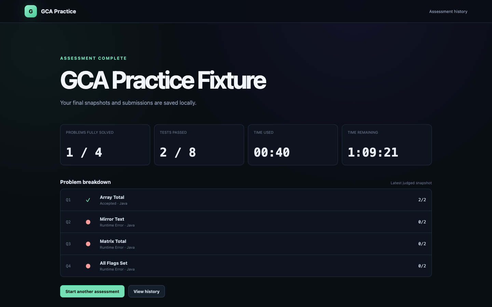

# GCA Practice

A local coding-assessment simulator with realistic timed sessions, native Java/C++/Python execution, and no account or cloud setup. Use it for focused GCA-style practice without question-bank spoilers or platform noise.



## Start

Requires Node.js 22+ and npm 10+. Python 3 is required to validate imported assessments; install a JDK and C++ compiler to enable Java and C++ submissions.

```sh
git clone https://github.com/nxtrio/CodeSignalClone.git gca-practice
cd gca-practice
npm start
```

`npm start` installs dependencies on the first run, starts the local API and web app, and opens [http://localhost:5173](http://localhost:5173). Press `Ctrl+C` to stop both. Use `npm start -- --no-open` to skip opening the browser. Set `GCA_WEB_PORT` or `GCA_API_PORT` if the default ports are occupied.

> [!WARNING]
> This is not a security sandbox. Validating imported JSON executes its Python reference solutions, and running an assessment executes your Java, C++, or Python code locally. Either can access files and the network or spawn processes. Only use code you trust; see [Security](SECURITY.md).

## What you get

- Four-question, 70-minute assessment sessions with autosave and resume
- Prompt-assisted assessment generation with strict JSON, semantic, and reference-solution validation
- Monaco editor with Java, C++, and Python runners
- Separate Run and Submit flows; hidden test details stay private during sessions
- Automatic completion, results, history, environment checks, and editor settings
- Privacy-safe JSON export for LLM readiness analysis and practice recommendations
- Local SQLite persistence—your assessments and code stay on your machine

| Import and validate | Solve in the assessment workspace |
| --- | --- |
|  |  |



## Development

```sh
npm run typecheck
npm test
npm run build
npm run test:e2e
```

Data is stored under `apps/server/data/` and is ignored by Git.

GCA Practice is an unofficial project and is not affiliated with or endorsed by CodeSignal. It does not include copied proprietary questions or visual assets. See the [implementation specification](implementation-plans/gca_practice_codex_implementation_spec.md), [contribution guide](CONTRIBUTING.md), and [MIT license](LICENSE).
